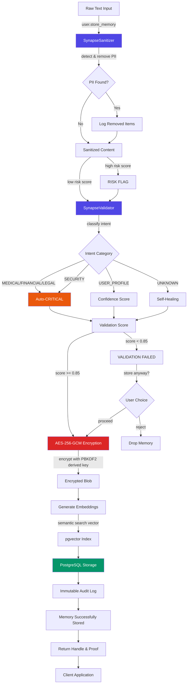
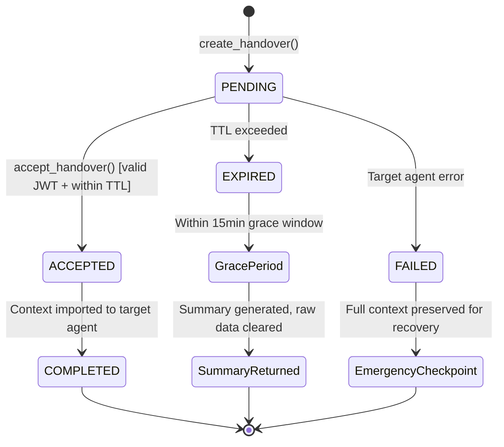
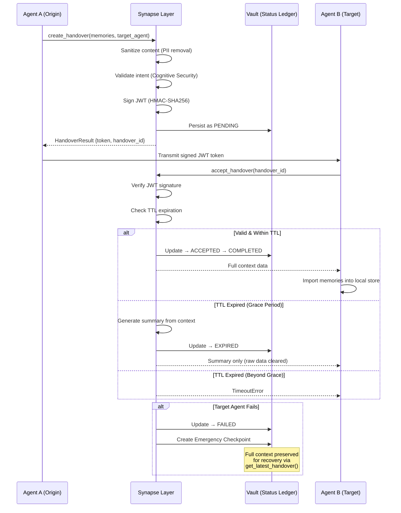

# ARCHITECTURE.md — Synapse Layer Complete Data Flow

## System Overview

Synapse Layer is a **Persistent Encrypted Memory Layer for AI Agents** with AES-256-GCM encryption at rest, intent validation, and trust-based conflict resolution.

### Core Principles

1. **Encrypted at Rest:** AES-256-GCM with per-operation random IV and HMAC-SHA-256 integrity
2. **Client-Side Sanitization:** PII removal before transmission
3. **Intent Validation:** Intelligent categorization with self-healing
4. **Trust Quotient:** Adaptive conflict resolution algorithm
5. **Immutable Pipeline:** sanitize → validate → encrypt → embed → store

---

## Complete Data Flow (Mermaid Diagram)



---

## Component Descriptions

### 1. SynapseSanitizer

**Purpose:** Remove PII before encryption

**Patterns Detected:**
- Email: `john@example.com`
- Phone: `+55 11 99999-8888`, `(123) 456-7890`
- SSN/CPF: `123-45-6789`, `123.456.789-00`
- Credit Card: `1234-5678-9012-3456`
- API Keys: `sk_test_...`, `ghp_...`
- URLs: `https://example.com`
- IP Addresses: `192.168.1.1`

**Output:** `SanitizationResult` with:
- `sanitized_content`: Content with PII replaced with `[TYPE_REDACTED]`
- `pii_count`: Number of PII items removed
- `risk_score`: 0.0–1.0 (CRITICAL: 0.3, HIGH: 0.15, MEDIUM: 0.05 per item)
- `ner_hints`: Hints for downstream NER processing
- `is_safe`: True if risk_score < 0.05

### 2. SynapseValidator

**Purpose:** Classify intent and validate confidence

**IntentCategory Enum:**
- `USER_PROFILE` (preferences, metadata)
- `CONVERSATION` (dialogs, chats)
- `DECISION` (commitments, goals)
- `KNOWLEDGE` (facts, learning)
- `PREFERENCE` (tastes, likes/dislikes)
- `MEDICAL` (health — **auto-critical**)
- `FINANCIAL` (payments — **auto-critical**)
- `LEGAL` (contracts — **auto-critical**)
- `SECURITY` (passwords — **auto-critical**)
- `UNKNOWN` / `INVALID`

**Thresholds:**
- Confidence: 0.0–1.0
- **Valid if confidence >= 0.85** (immutable threshold)
- **Auto-critical** for MEDICAL, FINANCIAL, LEGAL, SECURITY
- **Critical keywords:** emergency, urgent, breach, attack, fraud → auto-promote

**Self-Healing:** When confidence 0.5–0.85, detect context and upgrade category

### 3. AES-256-GCM Encryption

**Key Derivation:** PBKDF2-SHA256
- Iterations: **210,000** (NIST 2023 minimum)
- Salt: 32 bytes, randomly generated
- Output: 256-bit encryption key

**Encryption Mode:**
- Algorithm: AES-256-GCM
- IV: 96 bits, randomly generated per message
- Auth Tag: 128 bits (verifies integrity & authenticity)

**Process:**
```
User Password + Random Salt → PBKDF2(210k iterations) → 256-bit Key
                                                     ↓
                                          AES-256-GCM Encryption
                                                     ↓
                                          Encrypted Blob + Auth Tag
```

### 4. Embedding Generation

**Semantic Search:**
- Convert sanitized content to vector
- Dimension: 1536 (e.g., OpenAI embeddings)
- Index: pgvector (PostgreSQL vector extension with HNSW)

### 5. PostgreSQL + pgvector

**Schema:**
```sql
CREATE TABLE memories (
    id UUID PRIMARY KEY,
    agent_id UUID NOT NULL,
    encrypted_blob BYTEA NOT NULL,        -- AES-256-GCM ciphertext
    embedding vector(1536) NOT NULL,     -- Semantic search vector
    intent_category VARCHAR(50) NOT NULL,
    confidence FLOAT NOT NULL,
    is_critical BOOLEAN NOT NULL,
    created_at TIMESTAMP NOT NULL,
    updated_at TIMESTAMP NOT NULL
);

-- Row-Level Security (RLS)
ALTER TABLE memories ENABLE ROW LEVEL SECURITY;
CREATE POLICY agent_isolation
    ON memories
    FOR SELECT
    USING (agent_id = current_user_id());
```

**Constraints:**
- RLS (Row-Level Security) by agent_id
- Immutable audit trail
- Automatic deletion on TTL

### 6. Trust Quotient Calculation

```
TQ = f(Recency, Consistency, Confidence, Relevance)

Recency:     How fresh the memory (0-1)
Consistency: Agreement with other memories (0-1)
Confidence:  Validation confidence from SynapseValidator (0-1)
Relevance:   Semantic similarity to query (0-1)

Weights are proprietary and dynamically calibrated.
Full algorithm available under Enterprise license.
```

**Conflict Resolution:**
- When memories conflict, highest TQ wins
- Tie-breaker: Most recent timestamp
- Audit log records all conflicts and resolutions

---

## Pipeline Sequence (Immutable)

The following sequence is **mandatory and non-negotiable**:

1. **INPUT** → Raw text
2. **SANITIZE** → Remove PII (SynapseSanitizer)
3. **VALIDATE** → Classify intent (SynapseValidator)
4. **ENCRYPT** → AES-256-GCM with PBKDF2 key
5. **EMBED** → Generate semantic vector
6. **STORE** → Upsert to pgvector + audit log
7. **OUTPUT** → Memory handle + proof of storage

**No step can be skipped or reordered.**

---

## File Structure

```
synapse-layer/
├── synapse_memory/
│   ├── __init__.py
│   ├── core.py                    ← SynapseMemory (orchestrator)
│   ├── sanitizer.py               ← SynapseSanitizer (PII removal)
│   ├── privacy.py                 ← DifferentialPrivacy (DP noise)
│   ├── engine/
│   │   ├── __init__.py
│   │   ├── validator.py           ← SynapseValidator (intent validation)
│   │   └── handover.py            ← NeuralHandover (cross-agent transfer)
│   └── crypto/
│       └── __init__.py
├── ARCHITECTURE.md                ← This file
├── SECURITY.md
├── README.md
├── CHANGELOG.md
└── pyproject.toml
```

---

## Neural Handover — Persistence-First Architecture

Cross-agent context transfer with Status Ledger, JWT signing, and automatic fallback.

### Handover State Machine



### Handover Data Flow



### Handover JWT Token Structure

```
Header:   {"alg": "HS256", "typ": "SHT"}
Payload:  {"tid": "ho_...", "org": "gpt-4", "tgt": "claude-3.5",
           "uid": "user-123", "scp": "full", "iat": ..., "exp": ...}
Signature: HMAC-SHA256(header.payload, signing_key)
```

### Recovery Mechanisms

| Scenario | Action | Data Available |
|----------|--------|:-:|
| Normal | `accept_handover()` | Full context |
| Grace Period | Auto-summary | Summary only |
| Agent Failure | Emergency Checkpoint | Full context (frozen) |
| Full Expiry | `get_latest_handover()` | Summary only |

---

## Security Principles

- **Encrypted at Rest:** AES-256-GCM with per-operation random IV — content cleared after encryption
- **Client-Side Sanitization:** PII removed before leaving client
- **Immutable Audit:** Every operation logged; cannot be deleted
- **Differential Privacy:** Aggregate queries don't leak individual data
- **Handover Verification:** HMAC-SHA256 signed JWT tokens on cross-model transfers
- **Persistence-First:** All handovers vault-persisted before transmission

---

## Compliance & Standards

- ✅ **GDPR:** Data minimization, encryption, right to deletion
- ✅ **LGPD:** Consent, secure handling, audit trail (padrão bancário BR)
- ✅ **HIPAA:** Encryption + audit (with proper key management)
- ✅ **SOC 2:** Security controls, monitoring, incident response

---

## Performance Metrics

| Operation | Latency | Throughput |
|-----------|---------|-----------|
| Sanitize | < 10ms | 1000+ items/sec |
| Validate | < 5ms | 2000+ items/sec |
| PBKDF2 (210k) | ~100ms | Single-threaded |
| AES-256-GCM | < 5ms | ~100MB/sec |
| Embedding (API) | 100-500ms | Depends on provider |
| pgvector Search | < 50ms | HNSW index |

---

End of ARCHITECTURE.md
